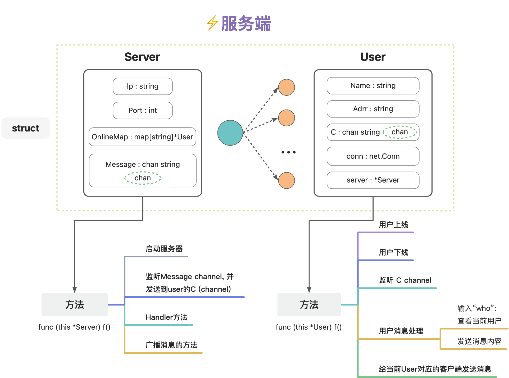

# 基于golang的即时通信功能

实现两台设备之间的通信：

1、启动服务端

    go build -o server server.go user.go
    ./server

2、直接连接（使用nc命令直接连接）

    nc 1xx.xx.xxx.xx 8888

注意ip地址是服务端的地址，与server函数中的一致

------
关于server端的组成：主要由Server和User两个struct和其对应的method组成

------
------

✋ 学习golang后实现的一个小功能，在研一的时候一直渴望我的笔记本能跟服务器进行即时发送消息的需求。比如就是我看到一个想下载到服务器上的链接，需要发个消息来复制。一个闭环完成～
