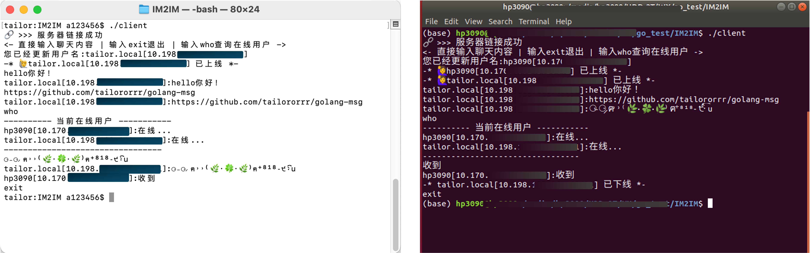

# 基于golang的即时通信功能

实现两台设备之间的通信：

1、启动服务端

    go build -o server server.go user.go
    ./server

2、直接连接（使用nc命令直接连接）

    nc 1xx.xx.xxx.xx 8888

注意ip地址是服务端的地址，与server函数中的一致

3、（或者）客户端连接

    go build -o client client.go
    ./client

 

------
关于server端的组成：主要由Server和User两个struct和其对应的method组成

------
------

✋ 学习golang后实现的一个小功能，研一的时候一直渴望我的笔记本能跟服务器即时发送消息。比如就是我看到一个想下载到服务器上的链接，需要发个消息来复制。一个闭环完成～
